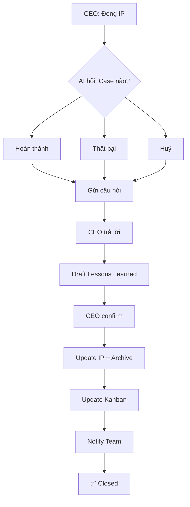

# 📦 IP Close Workflow

**Workflow file:** [`ip-close.md`](./ip-close.md)

---

## 🎯 Mục đích

Đóng Improvement Plan (IP) sau khi:
- ✅ **Hoàn thành** — IP đạt mục tiêu
- ❌ **Thất bại** — IP không đạt, cần rút bài học
- ❌ **Huỷ** — IP bị cancel

---

## 📋 Quick Reference

### 3 Trường hợp đóng IP

| Trường hợp | Điều kiện | Câu hỏi bắt buộc |
|------------|-----------|------------------|
| ✅ Hoàn thành | KPIs đạt, tasks done | "3 điều TỐT?", "3 điều cải thiện?", "Bài học?" |
| ❌ Thất bại | KPIs không đạt | "Tại sao thất bại?", "Nếu làm lại sẽ thay đổi gì?" |
| ❌ Huỷ | Cancel giữa chừng | "Tại sao huỷ?", "Lý do khách quan/chủ quan?" |

### Các bước chính

```
0. Hỏi CEO (xác định case) → 1. Gate Check → 2. Viết Lessons Learned →
3. Update Status → 4. Close Tasks → 5. Update Kanban → 6. Archive → 7. Notify
```

---

## 📁 Cấu trúc folder

```
ip-close/
├── ip-close.md              # Workflow chính
└── README.md                # File này
```

---

## 🔗 Liên kết với skills khác

| Workflow | Mối quan hệ |
|----------|-------------|
| [`ip-create`](../ip-create/ip-create.md) | IP được tạo ở đây → sau đó execute → close |
| [`ip-execute`](../ip-execute/ip-execute.md) | Sau execute → đến close |

---

## 📊 Lifecycle Diagram



---

## 📝 Ví dụ thực tế

*(Sẽ cập nhật sau khi có IP thực tế được đóng)*

```markdown
### IP-001: Seminar đầu tiên
- **Status:** ✅ Hoàn thành
- **KPIs:** 3/3 đạt (100%)
- **Lessons Learned:** Trong file `IP-001-done.md`
- **Bài học chính:** Cần chuẩn bị trước 2 tuần, check list thiết bị kỹ

### IP-015: Marketing campaign Q1
- **Status:** ❌ Thất bại
- **Lý do:** Không đạt conversion rate
- **Lessons Learned:** Trong file `IP-015-done.md`
- **Bài học chính:** Cần test channel nhỏ trước khi scale
```

---

## ✅ Checklist nhanh

```markdown
- [ ] Bước 0: Hỏi CEO — xác định case + câu trả lời
- [ ] Bước 1: Gate check — tasks closed
- [ ] Bước 2: Lessons Learned draft + CEO confirm
- [ ] Bước 3: Update IP status
- [ ] Bước 4: Close tasks + scheduler
- [ ] Bước 5: Update kanban
- [ ] Bước 6: Archive IP
- [ ] Bước 7: Notify team
```

---

**Owner:** TBD  
**Last reviewed:** 2026-04-08  
**Version:** 1.1
