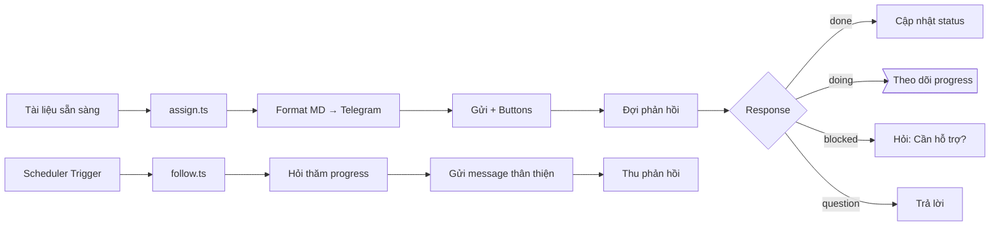

# 📦 Trợ lý Gửi Tài liệu

**Workflow file:** [`task-assign.md`](./task-assign.md)

---

## 🎯 Mục đích

Trợ lý gửi tài liệu, thông tin qua Telegram với:
- ✅ Auto format MD → Telegram text
- ✅ GitHub links click được
- ✅ Inline buttons reply
- ✅ **Tư duy:** Gửi tài liệu, không giao việc

---

## 📋 Quick Reference

### Gửi tài liệu (send)
```bash
bun run assign.ts IP-027-DES DES
bun run assign.ts IP-027-DEV DEV --dry-run
```

### Hỗ trợ theo dõi (follow)
```bash
bun run follow.ts IP-027-QA QA     # 1 task
bun run follow.ts IP-027            # Tất cả tasks
bun run follow.ts IP-027 --dry-run  # Xem trước
```

---

## 📁 Cấu trúc folder

```
task-assign/
├── task-assign.md          # Workflow chính
├── README.md               # File này
└── scripts/
    ├── assign.ts           # Gửi tài liệu
    └── follow.ts           # Hỗ trợ theo dõi
```

---

## 🔗 Liên kết với skills khác

| Workflow | Mối quan hệ |
|----------|-------------|
| [`ip-execute`](../ip-execute/ip-execute.md) | Tạo tasks → NEO gửi tài liệu cho team |
| [`ip-archive`](../ip-archive/ip-archive.md) | Hỏi thăm trong quá trình thực thi |

---

## 📊 Flow Diagram



---

## ✅ Checklist nhanh

### Gửi tài liệu
```markdown
- [ ] Task file created
- [ ] Frontmatter đầy đủ
- [ ] --dry-run trước
- [ ] Send thật
- [ ] Confirm success
```

### Hỗ trợ theo dõi
```markdown
- [ ] Xác định task/IP cần hỏi thăm
- [ ] --dry-run trước
- [ ] Send thật
- [ ] Thu callbacks
- [ ] Update status
- [ ] Nếu blocked → Hỏi "Cần hỗ trợ gì không?"
```

---

**Owner:** TBD  
**Last reviewed:** 2026-04-08  
**Version:** 1.1
